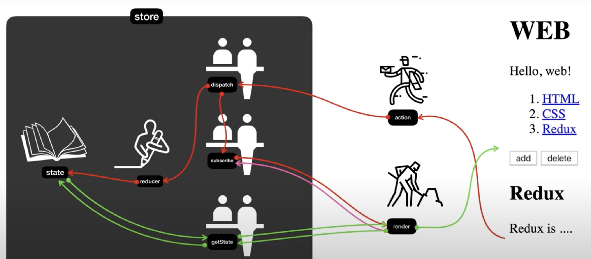

# Vanilla Redux

> 바닐라 리덕스를 이용한 간단한 CRUD를 가진 게시판 만들기

> with [생활코딩](https://opentutorials.org/module/4078)

> [생활코딩](https://opentutorials.org/module/4078/24935)

## flow에서 나오는 리덕스의 용어 정리

store : state가 저징되는 공간

state : (변화되는) 값

getState : stata는 store 외부에서 직접적으로 접근할 수 없다. state 값을 가져오기 위해선 반드시 getState를 이용해서 값을 가져올 수 있다.

render : (변화된) 값을 받아서 UI를 랜더링 하는 메소드. 값이 변할 때마다 랜더링이 이루어져야 한다. 이 때 이용하는 것이 `subscribe` 이다.

subscribe : 등록해 놓으면 값이 변함에 따라서 `render`를 호출하여 새로운 UI를 랜더링 하게 해준다

reducer : dispatch에 의해서 호출될 때, 2개의 값이 전달된다. 첫번째는 현재의 state와 두번째는 action이다. reducer는 전달받은 2개의 값을 토대로 새로운 state를 가공하여 반환한다.

action : 객체로서 dispatch에게 전달된다. action 안에는 `type`이라는 속성이 있다. 이 type이 state가 어떻게 변화할 것인지를 알려주는 flag 역할을 한다.

dispatch : 2가지 역할을 한다. 첫번째는 reducer를 호출하여 action을 전달하여 state의 변화을 유발한다. 두번째는 subscribe를 호출하여 변화된 state에 따라서 render를 유발한다.

## 리덕스가 좋은 이유

-   `중앙 집중적인` state 관리를 통해서 복잡도가 낮아진다
-   state의 변화에 따라서 `시간여행`이 가능하다

> [관련링크](https://medium.com/@wooder2050/%EB%A6%AC%EB%8D%95%EC%8A%A4-redux-%EB%8A%94-%EC%99%9C-%EC%93%B0%EB%8A%94-%EA%B1%B4%EB%8D%B0-2eaafce30f27)

## Exmaple

`구현 내용`

각각의 색을 갖고 있는 4개의 버튼이 있다. 각 버튼을 누르면 버튼이 갖고 있는 색으로 4개의 버튼의 배경색이 변화한다. 리덕스를 사용안하고 구현하면서 이에 대한 복잡도를 간접경험 해본다. 그 후 리덕스를 이용해서 리팩토링함으로서 리덕스가 필요한 이유에 대해서 느껴보자.

`without-redux VS with-redux`

## Project2
