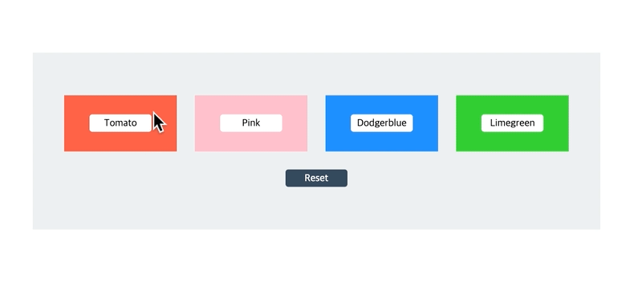
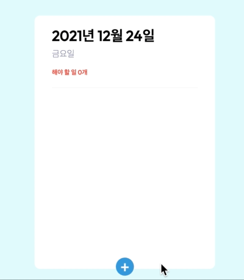

# Vanilla Redux

> 리덕스가 무엇이고 리덕스를 어떻게 사용하는지에 대해서 알아보고 기록하는 저장소입니다.

> Updated 2021.11 🚀 | Finished Projects 2021.12.24 🥳

참고

- 📺 [생활코딩 리덕스](https://opentutorials.org/module/4078)

- 📗 [리덕스 공식 홈페이지](https://ko.redux.js.org/)

- 🗒 [리덕스(Redux)는 왜 쓰는 건데⁉](https://medium.com/@wooder2050/%EB%A6%AC%EB%8D%95%EC%8A%A4-redux-%EB%8A%94-%EC%99%9C-%EC%93%B0%EB%8A%94-%EA%B1%B4%EB%8D%B0-2eaafce30f27)

- 📕 [리액트를 다루는 기술](https://thebook.io/080203/ch16-01/)

## Intro

리덕스하면 떠오르는 것이 리액트이다. 그래서 보통 리액트와 같이 사용해야하는 것이라고 생각한다. 하지만 그렇지 않다. 리덕스는 리덕스만으로 존재할 수 있고 바닐라 자바스크립트, 뷰, 앵귤러 등과 함께 다 사용이 가능하다. 리덕스는 자바스크립트 앱을 위한 `상태 관리 라이브러리`이다. 그래서 리덕스 자체를 이해하기 위해서 이번에는 바닐라 자바스크립트와 리덕스를 조합하여 정리하면서 작은 썸띵을 만들어보기로 했다.

## 리덕스

리덕스 이전의 앱 개발에서는 MVC패턴을 주로 사용하였다. MVC 패턴은 양방향 데이터 흐름을 가진다. 유저의 이벤트 발생으로 컨트롤러를 거쳐서 모델의 변화가 일어나서 뷰가 변경될 수 있다. 또한 뷰의 변화가 모델의 변화로 이어질 수 있다. 이러한 패턴은 역할 분리가 되어 있어서 개발할 때 개발의 효율성이 좋다. 또한 대규모의 앱이 아닌 경우에는, 데이터의 흐름을 읽어내기 편리한 부분이 있다. 하지만 앱의 규모가 커짐에 따라서 다수의 모델과 다수의 뷰가 하나의 컨트롤러로 연결되기 때문에 역할 분리를 한다한들, 의존성이 높아지게 된다. 이 때부터는 데이터의 흐름을 읽기가 어려워지고 이로 인해 버그를 추적하기도 어려워진다.

이러한 배경을 가지고 이를 해결하기 위해서 페이스북에서 `FLUX` 라는 아키텍쳐 패턴을 들고 나왔고, 이 패턴을 가지고 나온 라이브러리가 `REDUX` 이다.

위 이미지는 리덕스 공식홈페이지에 있는 이미지이다. MVC패턴과는 다르게 항상 데이터의 흐름이 한 방향으로만 이루어진다(단방향 데이터 흐름). 또한 데이터의 변화는 항상 리듀서 안에서만 이루어진다. 데이터의 변화는 단방향으로의 전달되는 액션에 의해서만 발생한다.

전체적인 흐름은 요약해보면 이렇다. 뷰에서 특정 이벤트가 발생하면 이벤트에 대한 `액션`을 `디스패쳐`에 의해서 `리듀서`로 전달하고 리듀서는 해당 액션에 맞게 데이터(`상태`)를 변경한다. 변경된 데이터는 `스토어`에 저장된다. 이 때 뷰는 데이터가 변경되었음을 감지하고 변경된 데이터를 통해서 리랜더링된다.

## 리덕스에서 알아하는 기본 용어 정리

> 위에서 전체적인 흐름을 이야기하는데 있어서 불편한(?) 용어들이 있었다. 그 부분을 정리해보자.

- 상태(State)

  리액트를 하다보면 props와 state의 개념에 대해서 알게 된다. 리액트에서 state는 컴퍼넌트 **내부**에서 사용되는 데이터로서 **동적인 데이터**를 말한다. 반대로 props는 컴퍼넌트 간의 **인터랙션**을 위해서 **전달하는 데이터**라고 보고 비교해보면 이해하기 수월하다. 그렇다면 리덕스에서 state는 무엇일까? 리덕스의 state는 전역으로 관리되는 데이터이다. (곧 나올 것이지만) 리덕스는 스토어라는 하나의 원천에서 state를 관리한다. 반대로 리액트에서 나온 state는 컴퍼넌트마다 지역적으로 관리되는 state이다. 즉 state를 두가지로 분류할 수 있는 것이다. `local state`와 `global state`. global state는 리덕스에 의해서 어떠한 컴퍼넌트에서도 접근이 가능하게 된다. 너무 리액트와 연결지어서 설명을 했지만, 요약해보면 리덕스에서 state는 리덕스의 스토어에서 관리하는 `전역적인 데이터 덩어리`라고 생각하면 된다. 이를 기술적으로 표현하면, 앱의 최상단에서 관리하는 `JS object` 이다.

  > 참고로 리덕스를 사용할 때, 자신이 사용할 데이터를 어떻게 관리할지를 정하는 것은 매우 중요하다. 지역적으로 관리할 것인지, 전역적으로 관리할 것인지에 따라서 로직이 달라지기 때문이다.

- 스토어(Store)

  간단하게 표현하면 스토어는 앞서 말한 **global state가 저장되는 공간**으로서 `하나의 앱에서는 하나의 스토어만 존재`할 수 있다. 하지만 좀 더 기술적으로(?) 살펴보도록하자. 스토어는 **여러 가지 메소드를 가진 객체**이다. 그 메소드들 중 하나가 state를 가져오는 메소드이다.

  - getState() : 현재 state를 반환하는 메소드

  - dispatch(action) : dispatch의 뜻인 "보내다" 라는 말처럼 액션을 보내는 역할을 한다. 리덕스에서 상태 변경을 위한 유일한 방법은 dispatch를 이용하는 것이다. dispatch에 인자로 보내는 액션은 어떠한 상태로 변경할지에 대한 내용을 담은 자바스크립트 객체이다.

  - subscribe(listener) : 유튜브에서 채널을 "구독"을 하면 채널에 대한 소식이 변경(?)될 때마다 알람이 온다. 이처럼 리덕스도 "구독"을 해야만 스토어에 있는 state가 변경되면 변경된 것을 감지하여 listener를 호출한다. 이 listener에 의해서 뷰에서의 특정 로직이 일어나게 된다.(리랜더링)

- 액션(Action)

  액션은 상태를 나타내는 단순 객체이다. 객체 안에서는 항상 `type`이라는 속성이 필요하다. 이 속성은 해당 상태의 이름(?)을 표현해주는 하나의 방식이다. 그 외에 일반적으로 `payload` 라는 속성을 갖는다. 이것은 나중에 상태 업데이트를 할 때 필요한 값들이 들어있는 공간이다. 또한 상태를 변경시키기 위해선 모든 데이터는 반드시 액션을 통해서만 가능하다.

- 액션 생성자(Action Creator)

  단순하게 액션을 생성해내는 함수이다. 이 액션 생성자는 왜 필요한가라는 의문을 갖을 수 있다. 상태의 변화를 만들때, 액션을 통해서 일어난다고 했다. 그렇다면 상태 변화를 만들고 싶을때 마다 액션을 매번 만들어줘야한다. 이는 매우 반복적인 작업이기 때문에 이러한 중복되는 상황을 방지하고자 액션 생성자를 통해서 관리하게 된다.

- 디스패치(Dispatch)

  스토어 설명에서 언급했지만, 액션을 스토어에 보내는 역할을 한다.( 좀 더 정확하게 말하면 스토어안에 있는 리듀서에 해당 액션을 보낸다.) 즉 액션이 일어나도록 만들어 주는 전달자 역할을 한다.

- 리듀셔(Reducer)

  새로운 상태를 만들어내는 함수이다. 리듀서는 **자바스크립트의 reduce의 개념**과 같다. 자바스크립트의 reduce는 기존의 누적값과 새로운 값을 받아서 새로운 누적값을 만들어내는 함수이다. 리덕스의 리듀서에서 누적값은 현재의 상태(state)와 전달 받은 액션(action)을 합셔서 **새로운 상태**가 이에 해당한다.

## 리덕스의 3가지 원칙

1. **Single source of truth(진실은 하나의 근원으로부터)**

   앱의 모든 상태(global state)는 최상단의 하나의 저장소에서 객체 (트리) 구조로 관리된다.

2. **State is read-only(상태는 읽기 전용이다)**

   상태를 직접 바꾸는 것은 어떠한 수단을 통해서도 불가능하다. 상태를 변경시키기 위해선 오직 액션 객체을 통해서만 가능하다.(액션 객체의 전달을 통해서 가능하다.)

3. **Changes are made with pure functions(변화는 순수 함수로 작성되어야한다)**

   먼저 순수함수에 대해서 간단히 정의해보자. 순수함수란 동일한 입력값에 항상 동일 출력값을 나타내고, 외부 상태에 영향을 받지 않는 함수를 말한다. ([참고](https://velog.io/@recordboy/%ED%95%A8%EC%88%98%ED%98%95-%ED%94%84%EB%A1%9C%EA%B7%B8%EB%9E%98%EB%B0%8D%EC%9D%98-%EC%88%9C%EC%88%98-%ED%95%A8%EC%88%98Pure-Function)) 이제 위 말을 이해해보자. 리덕스에서 변화가 일어나는 공간은 리듀서이다. 그렇기 때문에 리듀서는 반드시 순수함수로 작성되어야 한다는 말이다. 그렇기 때문에 리듀서는 항상 이전 상태와 업데이트할 상태를 합쳐서 새로운 상태 객체를 만들어낸다.

# Mini Projects

## project1

> 구현내용 : 4개의 버튼을 클릭함에 따라서 버튼의 바탕색이 클릭한 버튼색으로 변경된다. 바닐라 자바스크립트만으로만, 이것을 다시 바닐라 리덕스를 사용해서 각각 구현해봄으로서 리덕스를 사용하면 어떤 점이 어떻게 달라지고 리덕스의 flow를 느껴보고자 했다. 아래 이미지는 구현된 내용이다.

### Update/Refactor 2021.11

정확히 1년전에 해당 코드를 작성하고 1년 후에 코드를 보고 화들짝😬 놀랐다. 특히 바닐라 자바스크립트 코드를 보고 이벤트 위임을 이용하면 좀 더 깔끔한 코드를 만들수 있는데 왜 이렇게 했을까 하는 생각이 들었다.(처음 구현내용은 이벤트는 버튼마다 추가해주었다.) 그래서 바로 리팩토링을 진행하였다. 그에 맞춰서 리덕스를 사용한 코드 역시 같이 리팩토링 하였다. 아마도 그때 당시 단순한 구현이기때문에 좀 더 복잡함을 느끼기 위해서 반복을 늘리면서 코드를 구현한 것이 아닌가 하는 자기합리화적인(?) 생각이 들었다.😅

아래 코드를 보면 알겠지만 바닐라 자바스크립트보다 리덕스를 넣어서 구현한 내용이 훨씬 코드양도 많고 어려워 보인다. 그 이유는 구현한 내용 자체가 매우 단순하지만 그에 비해 필요없는 기술 스택(?)을 사용해서 그런 것 같다.(이런걸 오버엔지니어링이라고 한다던데...😱) 하지만 목적은 리덕스를 이해하는데 있었기 때문에 이것을 만들고 리팩토링하면서 리덕스의 흐름을 이해할 수 있음에 만족한다.

ps. JS코드가 단순한 이유는 `이벤트위임` 이라는 방법으로 모든 이벤트 처리를 단순화 시켰기 때문에 그렇다.

## project2

> CRUD를 가진 ToDo App을 만들어보자

### Update/Refactor 2021.11 / Finished 2021.12

처음엔 CRUD를 가진 메모장 혹은 블로그 느낌의 앱을 만들었다. 또한 코드적으로는 바닐라 자바스크립트를 이용한 리액트와 비슷한 상태관리 및 랜더링을 하는 코드를 구사해보려 하였다. 마치 예전에 프로그래머스의 프런트엔드 데브매칭에 계속 나왔던 바닐라 자바스크립트로 고양이 사진첩을 만드는 문제와 같은 스타일로 말이다.

약 1년정도 지난 뒤에 지금와서 보니 뭔가 굉장히 부산하고 코드를 이해하는게 너무 어려웠다. HTML을 자바스크립트로 만들고(마치 JSX 처럼) 거기에 로직이 들어가고 하다보니 너무 지저분해보였다. 가장 중요한 점은 내가 이 앱을 만드는 포인트를 잡지 못하고 있다는 생각이 들었다. 이 앱의 목적은 출시도 아니고 포트폴리오도 아니고 내가 리덕스를 이해하는데 최적화되어야만한다. 그런데 나름 스타일링도 예쁘게 하고 좀 구체적인 기능을 추가하려다 보니 코드가 너무 쓸데없어졌다. 중요 뼈대 코드를 먼저 만들고 거기서 살을 붙여나가야 하는데, 뼈대도 붙이기 전에 살을 붙이는 느낌이랄까!! 그래서 전반적으로 리덕스를 알아보는 앱에 대한 포인트를 잡고 HTML은 HTML대로 따로 구현하여 다시 리팩토링 하였다. 또한 테마도 가장 무난한 ToDo App으로 잡고 디자인은 리액트로 유명한 Velopert님 [리액트 TodoApp](https://mashup-todolist.surge.sh/)을 카피(?)하였다. (저 디자인이 지금까지 본 것 중에서 가장 깔끔한 듯하다. 디자인 고민하기 싫으면 강추!! 😝)

